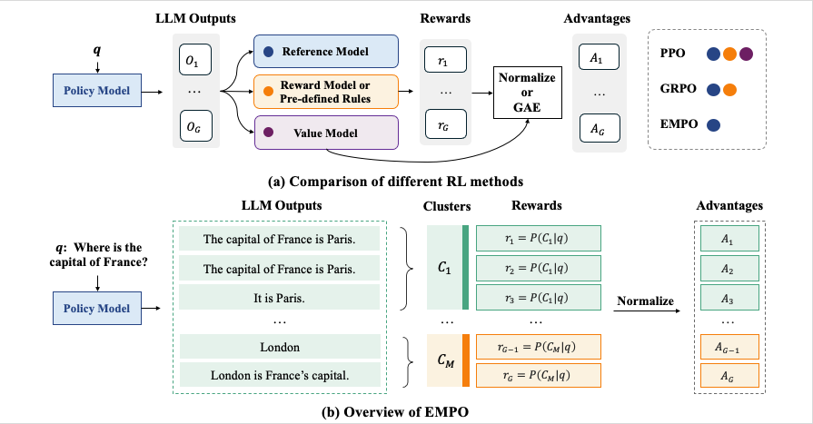
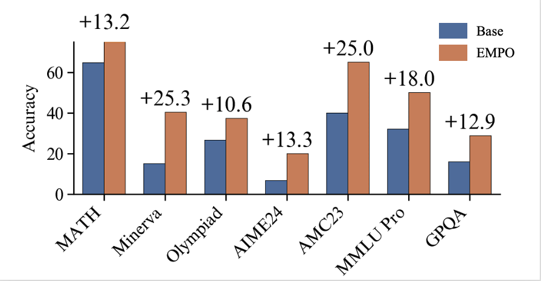

# EMPO: Fully Unsupervised LLM Reasoning Incentivization

<b>A Fully Unsupervised Implementation for Training R1-Zero-like Reasoning Models. </b>


<a href="https://huggingface.co/collections/qingyangzhang/empo-67f9f7ad7817ebff4b664010">🤗 HF Models and Datasets Collection </a> |
<a href="https://arxiv.org/abs/2504.05812"> 📑 Arxiv Preprint </a>

## 🆕 News

- [2025-04-08] We introduce EMPO, which makes the first attempt on fully unsupervised LLM reasoning incentivization. Check out our arxiv preprint (first released at 2025.04.08): https://arxiv.org/abs/2504.05812
- [2025-04-30] We release the training and evaluation code for both mathematical reasoning and free-form natural reasoning tasks.

## 🎯 Overview

EMPO (Entropy Minimized Policy Optimization) does not require any supervised information for incentivizing reasoning capabilities (i.e., neither verifiable reasoning traces, problems with golden answers, nor additional pre-trained reward models). By continuously minimizing the predictive entropy of LLMs on unlabeled user queries in a latent semantic space, EMPO enables purely self-supervised evolution of reasoning capabilities with strong flexibility and practicality.

<p align="center">

</p>

## 🏗️ Quick Start
### Requirements

```
pip install -r requirements.txt
```


### Mathematical Reasoning

Training with EMPO:

```
sh empo-1.5B-NM-COT-20K.sh
```

Evaluation:

```
sh eval_math/test.sh
```

We directly borrow the evaluation scripts from the Online-DPO-R1 project. Please refer to [Online-DPO-R1][https://github.com/RLHFlow/Online-DPO-R1] for more details.

### Free-form Natural Reasoning

Training with EMPO:

```
sh empo-3B-NR-50K.sh
```

Evaluation:

We are still working on cleaning the code. Stay tuned.


## 🏆 Performance

<p align="center">

</p>

## 🙏 Acknowlegement

This repo is built upon [Semantic Entropy](https://github.com/jlko/semantic_uncertainty), [PFPO](https://github.com/microsoft/unilm/tree/master/PFPO), [Open-R1](https://github.com/huggingface/open-r1), [Open-Reasoner-Zero](https://github.com/Open-Reasoner-Zero/Open-Reasoner-Zero), [Online-DPO-R1](https://github.com/RLHFlow/Online-DPO-R1), and [DAPO](https://dapo-sia.github.io). We thank all these researchers for generously sharing their insights, model weights, data, and codes.

## 📑 Related Works

There are many awesome works related to this paper that you may also interested with:

- LLM Uncertainty Quantification: [Semantic Entropy (ICLR'23, Nature'24)](https://openreview.net/pdf?id=VD-AYtP0dve)
- Test-time Adaption in Computer Vision: [COME (ICLR'25)](https://openreview.net/pdf?id=506BjJ1ziZ)
- Presudo Feedback for LLM Reasoning: [PFPO (ICLR'25 spotlight)](https://arxiv.org/abs/2411.16345)
- Test-time Reinforcement Learning: [TTRL (cocurrent work, first released at 2025.04.22)](https://arxiv.org/abs/2504.16084)

## 🖊️ Citation

If you find this work helpful, please consider to **star🌟** this repo. Thanks for your support!
```
@article{zhang2025right,
  title={Right Question is Already Half the Answer: Fully Unsupervised LLM Reasoning Incentivization},
  author={Zhang, Qingyang and Wu, Haitao and Zhang, Changqing and Zhao, Peilin and Bian, Yatao},
  journal={arXiv preprint arXiv:2504.05812},
  year={2025}
}
```